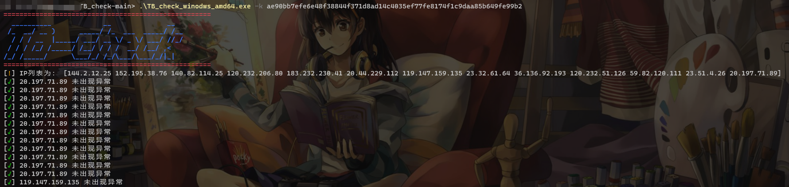
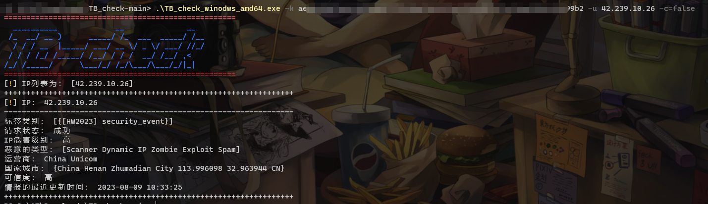
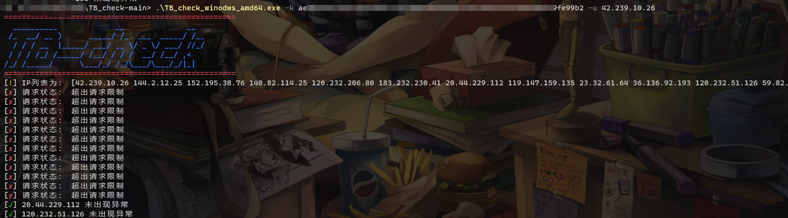

# 壹 TB_check介绍
该工具是基于微步接口对本机恶意IP自检的工具，其中有三个参数：

`-k`：微步的`key`值，必须要有该参数
`-u`：对指定IP进行单次检测
`-c`：对本机的所有IP进行检测，格式建议用`-c=xxxxxx`，默认值：true，进行自检

创建一个文件夹：`TB_check`，新建四个文件：`main.go`、`check.go`、`function.go`、`type.go`，在`TB_check`文件夹打开`cmd`，运行`go build .`，即可生成文件。

# 贰 使用

# 叁 更新

- v1.0.0
  初始版本
- v1.0.1
  更新了bug
