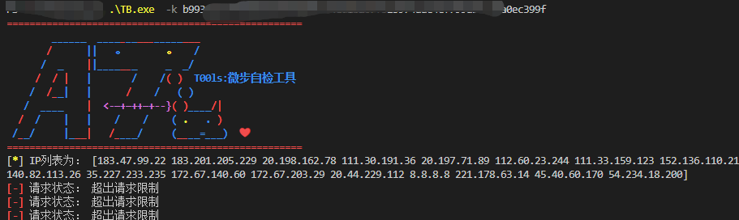
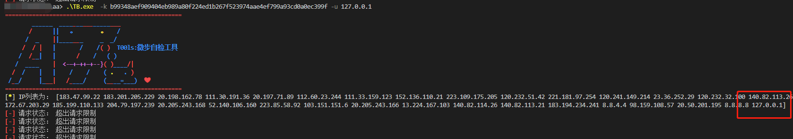

# 壹 TB_check介绍
该工具是基于微步接口对本机恶意IP自检的工具，其中有三个参数：

`-k`：微步的`key`值，必须要有该参数

`-u`：对指定IP进行单次检测

`-c`：对本机的所有IP进行检测，格式建议用`-c=xxxxxx`，默认值：true，进行自检

创建一个文件夹：`TB`，新建四个文件：`main.go`、`TBcheck.go`、`TBfun.go`、`TBtype.go`，在`TB`文件夹打开cmd，运行`go build .`，即可生成文件。该工具没有设置并发数。。。

# 贰 使用

